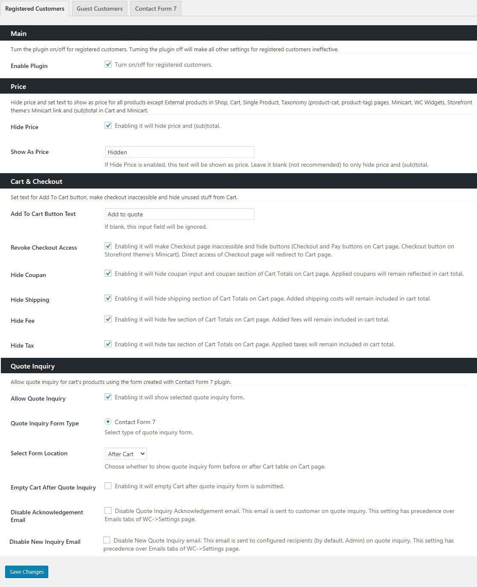
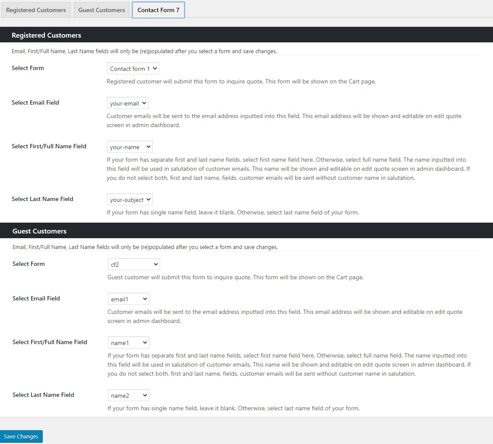

## Introduction
WC Quote Inquiry & Management is frontend quote inquiry and backend quote managment plugin for Woocommerce. It lets shop manager receive quote inquiries from registered, guest or both types of customers for products in cart and view, update, delete inquiries, turn quote inquiry into formal quote or create new quotes in backend.

### Features
- Receive quote inquires from registered, guest or both types of customers.
- Manage quote inquiries - view, update, delete.
- Create new quotes.
- Turn quote inquiry into formal quote by filling up product prices, adding fees, adjusting taxes and setting shipping cost.
- Search and select products to add in quote.
- Automatically send acknowledgement email to customer on quote inquiry.
- Automatically alert admin about new quote inquiry by email.
- Manually send quote email to customer.
- Emails styled just like default Woocommerce’s emails.
- Customize email templates by copying them to your-theme/woocommerce folder and changing them according to requirements.
- Disable acknowledgement and new inquiry alert emails for registered, guest or both types of customers.
- Globally disable emails for all users.
- Hide prices on Shop, Cart, Single Product, Taxonomy (product-cat, product-tag) pages, Minicart, WC Widgets, Storefront theme's Minicart link.
- Hide subtotal and total in Cart and Minicart.
- Set custom text to show as price and as (sub)total.
- Customize “Add to cart” button text.
- Revoke checkout page access. (Direct access of checkout page will redirect to cart page.)
- Hide coupon, shipping, fee or tax section from cart totals.
- Select quote inquiry form type. (Currently only Contact Form 7 is supported. Other form plugins will be integrated in future releases.)
- Select quote inquiry form location on cart - either before or after cart table.
- Clear cart after submission of quote inquiry form
- Select quote inquiry form from the list of Contact Form 7's forms.
- Select which field of quote inquiry form is email, first/last or full name field.
- Editable email, first/last or full name fields on quote inquiry edit screen.
- If Email, first/last or full name fields are not selected, registered user data will be used to populate these fields on quote inquiry edit screen.
- Separate settings for registered and guest  customers.
- Master switch to make all settings ineffective for registered or guest customers.

## Installation

### Minimum Requirements

- PHP 7.2 or greater is recommended
- MySQL 5.6 or greater is recommended
- Wordpress 5.0 or greater
- Woocommerce 4.0 or greater
- (optional) Contact Form 7 5.0 or greater

### Manual installation =

Manual installation method requires downloading this plugin and uploading it to your web server via your favorite FTP application. The WordPress codex contains [instructions on how to do this here](https://wordpress.org/support/article/managing-plugins/#manual-plugin-installation).

### Updating

Plugin will automatically check for new version and show update notification in Wordpress dashboard with one-click upgrade link.

### Configuration
- Open Dashboard -> Quotes -> Settings page.
- Enable plugin for registered, guest or both type of customers.
- Select quote inquiry form from the list of all Contact Form 7's forms and Save Changes.
- Select which field of the quote inquiry form to use as email, first/full name or last name fields. (Emails will not be sent to guest customer if you select a quote inquiry form for them and don't select one of the email fields of the selected form.)
- Change default settings as needed. (Default settings turn cart into quote basket.)

## Settings

### Tabs
- Registered Customers
- Guest Customers
- Contact Form 7 (It will be only added if Contact Form 7 plugin is active)

Registered Customers and Guest Customers tabs have similar settings.

### Setting Sections (of Registered/Guest Customers tabs)

#### Main
Turn the plugin on/off for registered/guest customers. Turning the plugin off will make all other settings for registered/guest customers ineffective.

##### Enable Plugin
Turn plugin on/off 

#### Price
Hide price and set text to show as price for all products except External products in Shop, Cart, Single Product, Taxonomy (product-cat, product-tag) pages, Minicart, WC Widgets, Storefront theme's Minicart link and (sub)total in Cart and Minicart.

##### Hide Price
Enabling it will hide price and (sub)total.

##### Show As Price
If Hide Price is enabled, this text will be shown as price. Leave it blank (not recommended) to only hide price and (sub)total.

#### Cart & Checkout
Set text for Add To Cart button, make checkout inaccessible and hide unused stuff from Cart.

##### Add To Cart Button Text
Set the text (e.g. Add to quote) for "Add to cart" button text. If blank, this input field will be ignored.

##### Revoke Checkout Access
Enabling it will make Checkout page inaccessible and hide buttons (Checkout and Pay buttons on Cart page, Checkout button on Storefront theme's Minicart). Direct access of Checkout page will redirect to Cart page.

##### Hide Coupan
Enabling it will hide coupan input and coupan section of Cart Totals on Cart page. Applied coupans will remain reflected in cart total.

##### Hide Shipping
Enabling it will hide shipping section of Cart Totals on Cart page. Added shipping costs will remain included in cart total.'

##### Hide Fee
Enabling it will hide fee section of Cart Totals on Cart page. Added fees will remain included in cart total.'

##### Hide Tax
Enabling it will hide tax section of Cart Totals on Cart page. Applied taxes will remain included in cart total.'

#### Quote Inquiry
Allow quote inquiry for cart's products using the form created with Contact Form 7 plugin.

##### Allow Quote Inquiry
Enabling it will show selected quote inquiry form.

##### Quote Inquiry Form Type
Select type of quote inquiry form.
If Contact Form 7 plugin is not active, this field will not have any option for selection.

##### Select Form Location
Choose whether to show quote inquiry form before or after Cart table on Cart page.

##### Empty Cart After Quote Inquiry
Enabling it will empty Cart after quote inquiry form is submitted.

##### Disable Acknowledgement Email
Disable Quote Inquiry Acknowledgement email. This email is sent to customer on quote inquiry. This setting has precedence over Emails tabs of WC->Settings page.

##### Disable New Inquiry Email
Disable New Quote Inquiry email. This email is sent to configured recipients (by default, Admin) on quote inquiry. This setting has precedence over Emails tabs of WC->Settings page.

### Setting Sections (of Contact Form 7 tab)

#### Registered Customers
Email, First/Full Name, Last Name fields will only be (re)populated after you select a form and save changes.

##### Select Form
Customer (registered or guest) will submit this form to inquire quote. This form will be shown on the Cart page.

##### Select Email Field
Customer emails will be sent to the email address inputted into this field. This email address will be shown and editable on edit quote screen in admin dashboard.

##### Select First/Full Name Field
If your form has separate first and last name fields, select first name field here. Otherwise, select full name field. The name inputted into this field will be used in salutation of customer emails. This name will be shown and editable on edit quote screen in admin dashboard. If you do not select both, first and last name, fields, customer emails will be sent without customer name in salutation.

##### Select Last Name Field
If your form has single name field, leave it blank. Otherwise, select last name field of your fo

#### Guest Customers
Same as Register Customers

## Frequently Asked Questions

- **Can i use a form created with other form plugins (e.g. Gravity Forms) as quote inquiry form?**

Currently, only Contact Form 7's forms are supported. Gravity Forms's forms will be supported in next version. Other form plugins may be supported in future.

- **Do you have any known Issue to tell?**
Currently, fees added on cart page or shipping cost calculated on cart page will not be visible on quote inquiry edit screen in backend. The Quote Total (referred as Order Total ) on quote inquiry edit screen will include both fees and shipping cost of cart page.
